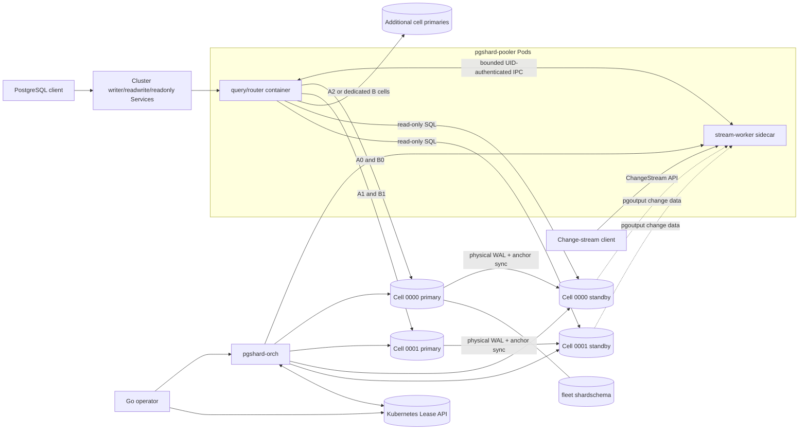

# Architecture

:::info Target architecture
This diagram describes the Milestone 1 target. Only the foundation items listed
in [implementation status](../project/status.md) currently exist.
:::

The target architecture separates the latency-sensitive data path from
declarative Kubernetes reconciliation. A `PgShardCluster` is a routing and
control-plane fleet containing independently placed logical databases, not one
cluster-wide database shard map. Rust components will route queries, manage
PostgreSQL cells, decode WAL, and recover distributed operations. The Go
operator will translate custom resources into cluster resources and
configuration. Change-stream serving is an internal `pgshard-pooler` subsystem,
not a separate deployment.

## Component responsibilities

| Component | Responsibility | Durable authority |
|---|---|---|
| Pooler Pod | Separately credentialed query/router and stream-worker modes of the same Rust binary: PostgreSQL protocol, pooling, routing, scatter reads, 2PC driving, bounded failover buffering, stream API, snapshots, per-shard `pgoutput` workers, cross-shard merge and resume vectors | None locally; validated routing epochs and acknowledged stream positions live in `shardschema` |
| Agent | PostgreSQL lifecycle, pgBackRest, role, LSN and slot-health reporting, quarantine and local mutation hooks | PostgreSQL and local volume state |
| Orchestrator | Fencing, promotion, operation state machines, abandoned 2PC recovery | PostgreSQL operation records |
| Operator | Kubernetes resources, defaults, resource-derived tuning, status, and owned Lease creation | Kubernetes API desired state |
| Kubernetes Lease API | Short-lived orchestrator leadership and per-cell writable-term coordination; accessed through the API server, never by connecting to control-plane etcd | No durable topology, operation, or transaction state |

PostgreSQL members have stable role-neutral names such as
`<cluster>-shard-0000-0`. Mutable `pgshard.io/role` labels select writer and
read-only endpoints, so promotion changes routing metadata rather than instance
identity. This follows CloudNativePG's stable instance plus `instanceRole`
pattern.

## Request path

The startup database selects a stable logical-database identity. The pooler
then hashes a registered table's shard-key value into that database's versioned
unsigned 64-bit keyspace, resolves its routing epoch to a physical cell, and
routes using the cached catalog snapshot. `A` may use five cells while `B` uses
three shared or dedicated cells. Single-shard transactions stay on one backend.
A transaction that enlists more than one shard of the same database uses
[two-phase commit](./distributed-transactions.md). Cross-database transactions
are outside Milestone 1.

## Embedded stream runtime

Every pooler Pod runs separately supervised query/router and stream-worker modes
of the same Rust `pgshard-pooler` binary in containers named `query-router` and
`stream-worker`. The query container parses untrusted application SQL but
receives no replication or checkpoint-mutation credentials. The sidecar never
accepts PostgreSQL client sessions and is the only container mounting those
credentials. A bounded
Unix-domain control socket on a shared memory volume checks the query
container's distinct Linux UID and admits only typed coordination requests; it
does not proxy arbitrary SQL or replication commands.

Change-stream RPCs, per-shard replication sessions, snapshot holders, merge
queues and acknowledgements therefore scale with the same fixed replica count
or HPA-managed `pgshard-pooler` Deployment. The HPA uses query-container CPU,
external query-admission pressure, and per-Pod stream queue fill described in
the [test contract](../operations/testing.md#required-end-to-end-environments).
Scale-down sends a selected Pod through a bounded pre-stop drain and grants it
no new stream ownership. Durable ownership and checkpoints remain external to
either container, so a drained or failed worker can hand off without inventing
progress.

Selectorless query and stream Kubernetes Services may expose different named
protocol ports through operator-owned EndpointSlices, but every endpoint still
belongs to a pooler Pod and owns no separate compute or scaling policy.

Replication sessions use dedicated native replication connections from the
sidecar; they never borrow a transaction-pooled SQL backend. Separate container
limits, bounded queues, memory budgets, concurrency limits and readiness signals
keep a slow stream consumer from exhausting query routing. Before termination,
a worker stops accepting new stream ownership and drains each fenced session,
while query connections use the normal bounded drain path. Lease expiry alone
never authorizes takeover: pgshard must rotate the durable owner fence, make
stale checkpoint writes fail, use agent-held pidfds to terminate and prove
inactivity of every exact old PostgreSQL replication and snapshot-holder
backend, and only then authorize a successor.

Live WAL delivery can resume from the last durable checkpoint after that
takeover proof. An exported snapshot cannot move between PostgreSQL sessions.
If forced termination loses a holder before `SnapshotComplete` is durably
spooled, pgshard marks that snapshot generation `ResnapshotRequired`; it never
continues a mid-copy cursor against a new snapshot.

The steady-state `pgoutput` path terminates on an eligible physical standby's
independent standby-local decoder. The primary keeps the failover anchor, whose
synchronized standby copy protects promotion, and serves application writes;
the pooler does not consume that anchor during normal operation. If no standby
proves checkpoint coverage and feedback health, the default policy fences the
stream instead of silently moving decoding load to the primary. Any emergency
primary fallback must be an explicit operator policy and remains visible in
`shardschema`.

## Control-plane availability

Poolers may continue serving routes from a previously validated epoch while `shardschema` is temporarily unavailable. New poolers, topology changes, DDL activation, authorization changes, and reshard activation fail closed until the authoritative catalog returns.

## Network boundary

Kubernetes Services select Pods, not containers, and kubelet makes ordinary Pod
readiness depend on every regular or restartable container. The query and
stream Services are therefore selectorless. The operator owns separate
EndpointSlices containing, respectively, only healthy named query ports and
only healthy named stream ports from non-terminating pooler Pods. Sidecar
failure can remove a stream endpoint without removing a healthy SQL endpoint;
query failure still removes SQL before it can receive a new connection.
PostgreSQL, Kubernetes Lease operations, agents, orchestration RPCs, metrics, and native replication
endpoints are protected by dedicated Services, container-specific credentials,
TLS identities, RBAC, and NetworkPolicies.
