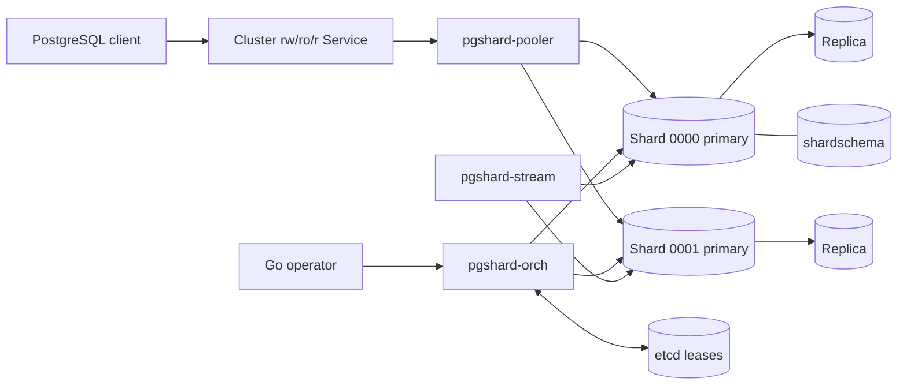

# Architecture

pgshard separates the latency-sensitive data path from declarative Kubernetes reconciliation. Rust components route queries, manage PostgreSQL instances, decode WAL, and recover distributed operations. The Go operator translates custom resources into cluster resources and configuration.

## Component responsibilities

| Component | Responsibility | Durable authority |
|---|---|---|
| Pooler | PostgreSQL protocol, pooling, routing, scatter reads, 2PC driving, bounded failover buffering | None; caches validated epochs |
| Agent | PostgreSQL lifecycle, pgBackRest, role and LSN reporting, native logical-replication connection | PostgreSQL and local volume state |
| Orchestrator | Fencing, promotion, operation state machines, abandoned 2PC recovery | PostgreSQL operation records |
| Stream | Merges per-shard `pgoutput`, snapshots, resume vectors, reshard journals | Acknowledged stream position in `shardschema` |
| Operator | Kubernetes resources, defaults, resource-derived tuning, status | Kubernetes API desired state |
| etcd | Short-lived leadership and fencing leases | No durable topology |

## Request path

The pooler hashes a registered table's shard-key value into a versioned unsigned 64-bit keyspace and routes it using a cached catalog epoch. Single-shard transactions stay on one backend. A transaction that enlists more than one shard uses [two-phase commit](./distributed-transactions.md).

## Control-plane availability

Poolers may continue serving routes from a previously validated epoch while `shardschema` is temporarily unavailable. New poolers, topology changes, DDL activation, authorization changes, and reshard activation fail closed until the authoritative catalog returns.

## Network boundary

Application Services select poolers only. PostgreSQL, etcd, agents, orchestration RPCs, metrics, and native replication endpoints are protected by dedicated Services, TLS identities, RBAC, and NetworkPolicies.
