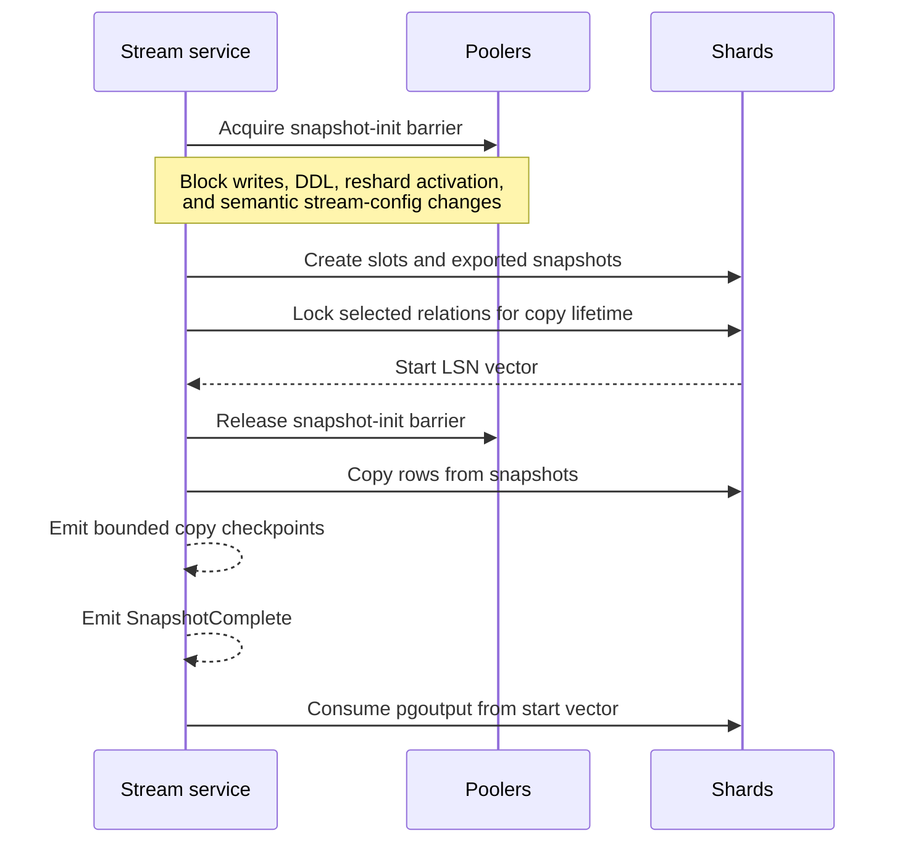

# Change streams

:::info Milestone 1 design contract
This page specifies the required behavior. Source code can decode PostgreSQL 18
replication envelopes and the buffered, streamed, and two-phase `pgoutput`
transaction controls without allocation. It does not yet decode row/schema
payloads or implement slots, ordering, acknowledgements, durable replay,
snapshots, cross-shard merge, or a stream service; see
[implementation status](../project/status.md).
:::

Milestone 1 will expose a cluster change stream derived from PostgreSQL 18
`pgoutput`. It is similar in purpose to Vitess VStream: clients consume one
logical stream across shards while positions remain a vector rather than an
invented global WAL order.

## Guarantees

- Preserve WAL order and transaction boundaries within each shard.
- Deliver at least once from the last acknowledged vector checkpoint.
- Never claim strict order between independent shards.
- Carry distributed-transaction identifiers without pretending participant events are one globally ordered batch.
- Protect resume tokens with authenticated versioning plus stream, cluster, database, semantic configuration, epoch, timeline, per-shard LSN, checkpoint generation and ordinal, and reshard-journal generation.

Only a `Checkpoint` carries an acknowledgeable resume token. Tokens are opaque,
server-issued, and authenticated. The server rejects altered, cross-stream,
cross-configuration, and future tokens. It accepts only checkpoints delivered
on the current RPC; duplicate or stale authenticated acknowledgements are
idempotent no-ops, so durable acknowledgement and slot feedback never regress.
Heartbeats expose non-acknowledgeable source progress and the last fully
delivered position, so a consumer cannot acknowledge past buffered WAL it has
never received.

Milestone 1 buffers or spills PostgreSQL streaming-transaction chunks until the
terminal outcome is known. Aborted transactions expose no row events. A committed
transaction's begin, row events and terminal commit are emitted contiguously in
source order. Prepared rows remain buffered until `COMMIT PREPARED`; no checkpoint
can advance beyond an unresolved prepared transaction.

Each durable stream config sets maximum events and canonical payload bytes for
one transaction, a maximum for any individual data event, and a separate bound
for control events. Canonical payload bytes encode only the selected event
message; per-connection sequence/timestamp fields and transport framing are
excluded, so a replay cannot change whether data fits. Clients cannot request an
unacknowledged window below the transaction or individual-event maxima.

`Checkpoint` and the other bounded control events do not consume the data
window. A transaction exactly at the limit can therefore still emit its sole
acknowledgeable checkpoint. Oversized transactions emit no part and terminate
with `TRANSACTION_TOO_LARGE`; an oversized snapshot row, relation, schema, or
reshard journal terminates with `EVENT_TOO_LARGE`. Both stop at the last
acknowledged token and require a larger durable limit before resuming. Delivery
limits are excluded from the token's semantic configuration hash, so monotonic
limit increases remain compatible with an existing token.

`StreamError` and `ResnapshotRequired` are terminal responses followed by a
non-OK gRPC status. A normal retry uses only the explicitly returned last
acknowledged token; a resnapshot response cannot be treated as a checkpoint.

Consumers must durably apply a checkpoint before acknowledging it. Reconnection can replay changes after the last acknowledgement; consumers therefore need idempotency or deduplication. Exactly-once delivery is not claimed.

Snapshots emit bounded checkpoints throughout row copy. Their opaque token and
durable server state bind the retained snapshot-session ID, copy phase, and each
shard's relation plus deterministic chunk cursor; the WAL vector alone is not a
snapshot cursor. Snapshot-holder sessions run independently of the client RPC,
so a gateway or client reconnect can continue the same exported snapshots with
at-least-once replay after the last acknowledgement. If a holder, slot, or
exported snapshot is lost before copy completes, the service returns
`ResnapshotRequired` instead of combining a new snapshot with the old WAL vector.

## Snapshot plus changes

The short barrier coordinates snapshot initialization; it does not manufacture
a global PostgreSQL snapshot. Application writes, DDL activation, routing or
topology activation, reshard cutover, and semantic stream-configuration changes
cannot cross this window. In-flight distributed transactions and recovery are
drained or held at the same barrier before any per-shard slot is created, so the
assembled shard set, semantic configuration hash, and start-position vector are
one coherent catalog epoch.

Before that barrier is released, each retained snapshot transaction acquires
`ACCESS SHARE` on every selected relation in deterministic OID order and holds
the locks through `SnapshotComplete`. Normal DML can resume after initialization,
but managed DDL activation that would alter, swap, or drop copied storage waits
or fails its bounded activation deadline. This pins relation identity and
storage for all later chunks rather than relying on the MVCC snapshot alone.

Completing row copy is not itself permission to discard replay state. Before a
holder releases its snapshot transaction and relation locks, every snapshot
event not yet covered by an acknowledgement—including `SnapshotComplete`—is
written to the durable, bounded stream spool. That spool survives client and
gateway reconnects and remains until the checkpoint covering `SnapshotComplete`
is durably acknowledged. If the spool cannot be persisted, the holder and locks
remain; timeout or retention exhaustion terminates the snapshot and requires a
new one rather than releasing unreplayable state.

## Resharding and schema

Managed DDL produces a `Schema` event only after every shard activates the new schema epoch. Reshard activation emits a durable journal mapping old range positions to the target topology. Old tokens follow this journal chain or terminate with `ResnapshotRequired`; topology changes must never silently create a gap.

## WAL retention safety

Slow consumers retain WAL. Each stream has acknowledgement deadlines, inactivity limits, warning thresholds, and a hard retained-WAL cap. At the cap, database availability wins: pgshard fences the stream, removes its slots, and requires a fresh snapshot. A restored cluster also requires external consumers to resnapshot because timelines can fork.
