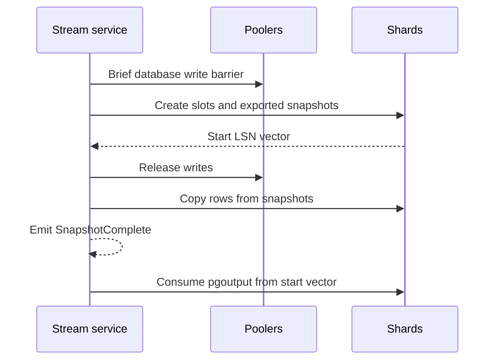

# Change streams

pgshard exposes a cluster change stream derived from PostgreSQL 18 `pgoutput`. It is similar in purpose to Vitess VStream: clients consume one logical stream across shards while positions remain a vector rather than an invented global WAL order.

## Guarantees

- Preserve WAL order and transaction boundaries within each shard.
- Deliver at least once from the last acknowledged vector checkpoint.
- Never claim strict order between independent shards.
- Carry distributed-transaction identifiers without pretending participant events are one globally ordered batch.
- Protect resume tokens with cluster, database, configuration, epoch, timeline, per-shard LSN, and reshard-journal generation.

Consumers must durably apply a checkpoint before acknowledging it. Reconnection can replay changes after the last acknowledgement; consumers therefore need idempotency or deduplication. Exactly-once delivery is not claimed.

## Snapshot plus changes

The short barrier coordinates snapshot initialization; it does not manufacture a global PostgreSQL snapshot. DDL cannot activate through this initialization window.

## Resharding and schema

Managed DDL produces a `Schema` event only after every shard activates the new schema epoch. Reshard activation emits a durable journal mapping old range positions to the target topology. Old tokens follow this journal chain or terminate with `ResnapshotRequired`; topology changes must never silently create a gap.

## WAL retention safety

Slow consumers retain WAL. Each stream has acknowledgement deadlines, inactivity limits, warning thresholds, and a hard retained-WAL cap. At the cap, database availability wins: pgshard fences the stream, removes its slots, and requires a fresh snapshot. A restored cluster also requires external consumers to resnapshot because timelines can fork.
