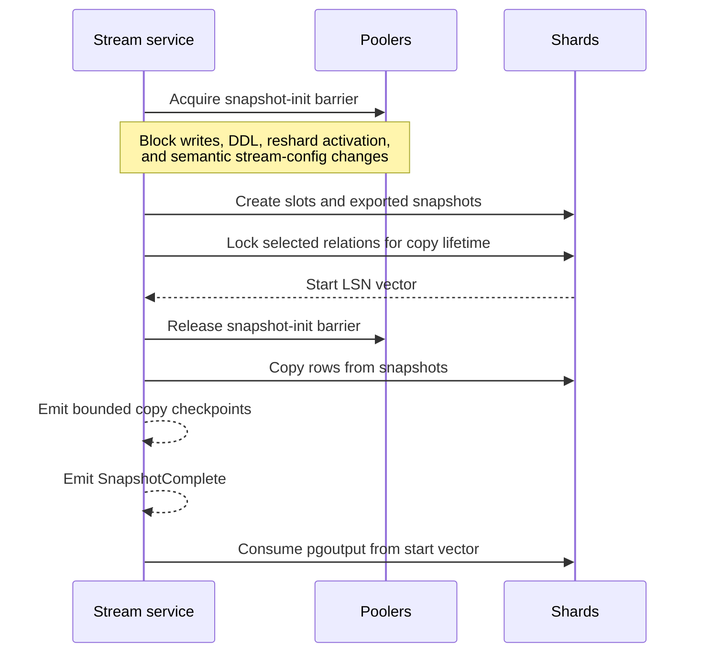

# Change streams

:::info Milestone 1 design contract
This page specifies the required behavior. Source code can decode PostgreSQL 18
replication envelopes and the buffered, streamed, and two-phase `pgoutput`
transaction controls, Relation and Type schema metadata,
Insert/Update/Delete/Truncate row bodies, and—when the accepted command
explicitly enabled `messages`—custom logical Message records without
allocation. A segment-layout state machine derives streamed schema,
row, and custom-message XID prefixes from Stream Start/Stop rather than caller
selection. Stream Start identifies the top-level transaction, while each
schema or row prefix may identify a subtransaction. A custom Message inside a
stream must be transactional and repeat the active top-level XID. Live
PostgreSQL 18 coverage shows that a Message emitted inside a savepoint retains
that top-level XID while the Relation record carries the savepoint XID. It does
not yet implement a complete
transaction-order machine, relation cache, slots, acknowledgements, durable
replay, snapshots, cross-shard merge, or a stream service; see [implementation
status](../project/status.md).

The operator's generated configuration plan now reserves separate capacity for
primary failover anchors, synchronized copies, standby-local decoding slots,
and the temporary physical slots needed when a decoder is promoted. It renders
primary and standby PostgreSQL 18 role profiles for every member, with the
mandatory feedback and slot-synchronization settings described below. The Rust
orchestrator source also has a pure two-stage attachment validation model. Its
preflight rejects a changed standby member or direct-primary source identity, a stale
multi-server observation, a cascading upstream, insufficient WAL level,
disabled feedback, a reporting interval without a fixed freshness margin,
stale feedback, an absent, wrong-source, stale, or connection-generation-mixed
slot-sync worker observation, a replay position behind the durable checkpoint,
a live receiver slot or primary walsender that cannot be tied to the exact
physical-slot owner, unsafe physical or logical slot WAL retention, an active
or unowned primary anchor or standby-local decoder, a physical slot omitted
from the primary's failover-slot gate, an absent or unsafe
primary/synchronized anchor pair, the wrong anchor/local role, a slot
generation that differs from its active catalog allocation, a currently wrong
two-phase mode or activation boundary, or a slot whose
confirmed-flush LSN is ahead of the durable checkpoint. After a quarantined
attachment reportedly acquires the local slot, a fresh full observation checks
that slot's active PID and the caller-reported start checkpoint. The result is
explicitly non-authorizing: pure values cannot prove the PID and LSN came from
the actual `BackendKeyData` and encoded `START_REPLICATION` command. The future
connection-owning runtime must bind those facts in one linear session state;
no record may be emitted, delivered, or acknowledged before it does. Both
copies of the failover anchor
are checked but never selected while the server is in recovery, and transient
ownership of the synchronized copy by PostgreSQL's slot-sync worker is
accepted. `shardschema` now stores permanent consumer, checkpoint, attachment,
and managed-slot generations with fenced lifecycle constraints and PostgreSQL
18 contract coverage. A bounded Rust reader now loads one exact ready
consumer/database/shard/member policy in a read-only repeatable-read transaction,
including its cluster and restore identity, ownership fence, checkpoint ordinal,
primary anchor, and standby-local slot generation. It returns no attachable
policy for a fenced owner, another member, or primary fallback, and fails closed
when a required singleton or ready-policy component is absent, a snapshot is
incomplete, the checkpoint ordinal is zero, or an active slot boundary is ahead
of the durable checkpoint. Every construction and load has one validated
absolute client deadline. Inside a load, the remaining PostgreSQL statement
timeout is recomputed before every catalog query, leaving time for an observed
rollback, and a PostgreSQL 18 transaction timeout backs up the whole transaction
through commit. Only a statement cancellation followed by completed rollback
retains the connection for retry. A hard client deadline or transaction timeout
makes the reader terminal and requires a fresh connection. It does not
select a member, observe or mutate PostgreSQL slots, or authorize a connection.
No PostgreSQL Pod consumes the profiles, and secure `primary_conninfo`, live
observation, slot creation or mutation, role activation, quarantined attachment,
and stream ownership remain unimplemented.

The source also contains a fixed-size PostgreSQL 18 Standby Status Update
encoder. It validates that neither flush nor apply is ahead of write but does
not decide when progress is durable or safe to acknowledge. PostgreSQL permits
apply to be ahead of flush for locally written, unflushed work, so the actual
within-sample checks are `flush <= write` and `apply <= write`. The future
stream owner must advance its persisted checkpoint before reporting the
corresponding flush position. A state machine scoped to one COPY-BOTH session
rejects any write, flush, or apply regression across samples all-or-nothing.
After disconnect, the owner discards volatile write and apply progress and
starts a new tracker with all positions at the last durable checkpoint.
The live PostgreSQL 18 fixture sends the encoded frame in COPY-BOTH mode and
proves that the server records distinct write, flush, and apply positions and
honors its immediate-reply request after the initial catch-up keepalive is drained.
:::

Milestone 1 will expose a cluster change stream derived from PostgreSQL 18
`pgoutput`. It is similar in purpose to Vitess VStream: clients consume one
logical stream across shards while positions remain a vector rather than an
invented global WAL order.

## Guarantees

- Preserve WAL order and transaction boundaries within each shard.
- Deliver at least once from the last acknowledged vector checkpoint.
- Never claim strict order between independent shards.
- Carry distributed-transaction identifiers without pretending participant events are one globally ordered batch.
- Protect resume tokens with authenticated versioning plus stream, cluster,
  database, semantic configuration, epoch, each per-shard source-attachment
  identity, timeline and LSN, checkpoint generation and ordinal, and
  reshard-journal generation.

Only a `Checkpoint` carries an acknowledgeable resume token. Tokens are opaque,
server-issued, and authenticated. The server rejects altered, cross-stream,
cross-configuration, and future tokens. It accepts only checkpoints delivered
on the current RPC; duplicate or stale authenticated acknowledgements are
idempotent no-ops, so durable acknowledgement and slot feedback never regress.
Heartbeats expose non-acknowledgeable source progress and the last fully
delivered position, so a consumer cannot acknowledge past buffered WAL it has
never received.

The token contains a canonical authenticated hash of every shard's restore
incarnation, PostgreSQL system identifier, and database OID independently of the
stream's semantic-configuration hash. Resume and acknowledgement validate that
attachment vector before reading or advancing any checkpoint or replication
slot. During restore, one non-serving `shardschema` transaction installs the new
shard incarnations, advances the affected checkpoint generations, and marks the
streams as requiring a snapshot. A token from the restored history therefore
returns `SOURCE_INCARNATION_CHANGED` without changing durable checkpoint or slot
state, even if its cluster, database, timeline, and LSN fields still match.

Milestone 1 buffers or spills PostgreSQL streaming-transaction chunks until the
terminal outcome is known. Aborted transactions expose no row events. A committed
transaction's begin, row events and terminal commit are emitted contiguously in
source order. Prepared rows remain buffered until `COMMIT PREPARED`; no checkpoint
can advance beyond an unresolved prepared transaction.

Each durable stream config sets maximum events and canonical payload bytes for
one transaction, a maximum for any individual data event, and a separate bound
for control events. Canonical payload bytes encode only the selected event
message; per-connection sequence/timestamp fields and transport framing are
excluded, so a replay cannot change whether data fits. Clients cannot request an
unacknowledged window below the transaction or individual-event maxima.

`Checkpoint` and the other bounded control events do not consume the data
window. A transaction exactly at the limit can therefore still emit its sole
acknowledgeable checkpoint. Oversized transactions emit no part and terminate
with `TRANSACTION_TOO_LARGE`; an oversized snapshot row, relation, schema, or
reshard journal terminates with `EVENT_TOO_LARGE`. Both stop at the last
acknowledged token and require a larger durable limit before resuming. Delivery
limits are excluded from the token's semantic configuration hash, so monotonic
limit increases remain compatible with an existing token.

`StreamError` and `ResnapshotRequired` are terminal responses followed by a
non-OK gRPC status. A normal retry uses only the explicitly returned last
acknowledged token; a resnapshot response cannot be treated as a checkpoint.

Consumers must durably apply a checkpoint before acknowledging it. Reconnection can replay changes after the last acknowledgement; consumers therefore need idempotency or deduplication. Exactly-once delivery is not claimed.

Snapshots emit bounded checkpoints throughout row copy. Their opaque token and
durable server state bind the retained snapshot-session ID, copy phase, and each
shard's relation plus deterministic chunk cursor; the WAL vector alone is not a
snapshot cursor. Snapshot-holder sessions run independently of the client RPC,
so a gateway or client reconnect can continue the same exported snapshots with
at-least-once replay after the last acknowledgement. If a holder, slot, or
exported snapshot is lost before copy completes, the service returns
`ResnapshotRequired` instead of combining a new snapshot with the old WAL vector.

## Standby-first slot topology

All pgshard-managed `pgoutput` consumers use one placement policy. This includes
public change streams, online-reshard catch-up and its target materializers, and
future internal materializations. Normal decoding runs on an eligible direct
physical standby to keep logical decoding work off the shard primary. This is a
placement preference, not permission to lose or skip data: if no standby can
prove that it retains the durable per-shard checkpoint, pgshard either uses the
primary's anchor slot or fences the consumer and requires a new snapshot.

`shardschema` is the authority for every managed logical consumer. Each
per-shard record is keyed by consumer, `logical_database_id`, and shard. Its
source-attachment key adds the shard restore incarnation, PostgreSQL system
identifier from `pg_control_system()`, and database OID; the database name is
descriptive metadata, not identity. It also records the bounded purpose,
cluster-scoped primary anchor, explicit selected source role, source server and
timeline, member-ordinal-bound standby-local slot and consistent point, each
active slot's catalog generation and generation-encoded name, durable
source-bound checkpoint and checkpoint generation, and ownership fence. The
migration implements those records and permanently tombstones retired names and
generations, while the pure attachment validator
only accepts caller-supplied active catalog values. The catalog rejects
checkpoint seeding or regression, progress changes during retirement,
generation-incompatible slot names or generation rebinding, source-identity
rebinding, checkpoint progress without active exact-lineage source and anchor
slots, activation without a primary anchor and selected source slot, snapshot
completion behind either slot's consistent point or two-phase boundary,
readiness without a resumable checkpoint, and retirement out of order. A
consumer cannot attach to a slot until the future connection-owning runtime
proves the loaded fields match its current catalog epoch and lease. Catalog
presence by itself is non-authorizing.

Each checkpoint generation is immutably bound to its shard restore incarnation,
PostgreSQL system identifier, database OID, and source timeline. Physical
replicas share the system identifier and database OID, so a source move on the
same timeline can retain the checkpoint. A timeline change must rotate the
source attachment and, until a future ancestry proof exists, allocate a
snapshot-required checkpoint generation; bare LSNs are never compared across
catalog lineages. The synchronized anchor still preserves PostgreSQL failover
state, but does not by itself authorize checkpoint reuse. A reinitialized shard
has a different system identifier. A restore can reuse both the system
identifier and database OID, so every initial bootstrap and coordinated restore
must install a fresh immutable shard restore-incarnation UUID before slot
reconciliation or application service. Any mismatch is fenced and requires a
compatible snapshot instead of rebinding the record. This prevents workers,
databases, restored histories, or different uses such as a public stream and a
reshard materializer from sharing a slot or advancing each other's checkpoint.

PostgreSQL's synchronized logical slots and standby-local decoding slots have
different jobs. A synchronized slot copied from the primary cannot be consumed
on a hot standby before that standby is promoted, and a logical slot created
locally on a standby cannot be marked as a failover slot and synchronized to
its peers. Milestone 1 therefore keeps two explicit classes of slot per logical
consumer and shard:

- a persistent `failover = true` anchor on the current primary, advanced no
  further than the durable checkpoint stored in `shardschema`; and
- persistent, non-failover decoding slots created locally on eligible standbys,
  from which the active stream worker consumes `pgoutput`.

The operator automatically synchronizes each primary anchor to eligible direct
standbys for promotion safety. Standby-local slots are independent and
reconciled separately; pgshard never describes them as synchronized and never
treats a PostgreSQL-synchronized slot as usable on a server that is still in
recovery. The anchor allocation is cluster-scoped and has no member identity;
its synchronized physical copies and current primary placement are observed
runtime state. Each standby decoder allocation is member-bound. `shardschema`
records its canonical member ordinal, the attachment's selected role, and each
local slot's consistent point and two-phase boundary. A new local slot is
ineligible while either boundary is ahead of the durable checkpoint because
PostgreSQL cannot decode the missing older WAL through that slot. The old source
or primary anchor remains active until the checkpoint reaches both boundaries;
if neither retains the gap, the stream requires a new snapshot. Source
selection is fenced by shard term, restore incarnation, system identifier,
database OID, timeline, catalog epoch, slot identity, both activation
boundaries, and the durable checkpoint. A safe source change starts from that
checkpoint and can replay already acknowledged WAL, so the public contract
remains at-least-once.

For every shard that can host a decoder or receive a synchronized anchor, the
operator enforces the PostgreSQL 18 prerequisites as one configuration unit:

- `wal_level = logical`, sufficient `max_replication_slots`, and sufficient
  `max_wal_senders` on the primary and every eligible standby;
- `hot_standby = on`, `hot_standby_feedback = on`, a bounded positive
  `wal_receiver_status_interval` at least one second below the
  feedback-health bound, and `sync_replication_slots = on` on eligible
  standbys;
- one durable physical slot per standby, named by its `primary_slot_name`, plus
  a valid database name and the member profile's exact `application_name` in
  `primary_conninfo`; and
- a primary `synchronized_standby_slots` policy containing the physical slots
  whose receipt must gate failover-anchor progress.

PostgreSQL 18's slot-sync worker uses one SQL-capable `primary_conninfo`
database connection to query failover slots across the direct primary; that
connection database does not have to be each logical slot's database. Decoder
and promotion eligibility instead bind the current worker connection to the
exact primary server and a non-nil connection generation, then require a
bounded, recent completely successful synchronization cycle recorded for that
same connection generation. Each logical slot is still checked against its own
catalog database OID. The setting and continued existence of an old
synchronized slot are not accepted as worker health: a missing
`primary_conninfo` `dbname`, connection failure, a success from an earlier or
different connection, or a stale cycle fences the member.

The candidate's live `pg_stat_wal_receiver.slot_name` must equal the managed
physical slot. On the primary, the matching `pg_stat_replication` walsender PID
and configured member `application_name` must identify the same backend as that
physical slot's `active_pid`. `primary_slot_name` configuration alone is not
proof of the active connection.

A demoted primary cannot immediately enable its standby profile. It can retain
primary failover anchors whose names now belong to synchronized copies from the
new primary, and PostgreSQL 18's slot-sync worker rejects a same-named local
slot that is not already marked as synchronized. Rejoin therefore fences the
member and every slot user, transfers and verifies durable consumer checkpoints,
and reconciles only catalog-owned slots. Obsolete primary anchors and physical
slots are dropped before `sync_replication_slots` is enabled. An orderly
switchover performs that cleanup while the old primary remains fenced and before
its role changes. After an unplanned failover, the old member is never restarted
writable merely to clean slots; it is reinitialized from the new primary and
its slot state is verified clean. An unknown or user-owned collision requires
operator intervention and is never deleted automatically. The member remains
ineligible for decoding and promotion until a fresh synchronized copy has been
observed healthy.

Milestone 1 creates every managed logical slot with two-phase decoding enabled.
`shardschema` records each never-reused slot generation, a name ending in that
generation's full UUID, and the exact PostgreSQL `two_phase_at` boundary. The
primary failover anchor and its synchronized copy must match the same recorded
boundary; each standby-local decoder matches its own recorded activation
boundary. Enabling or disabling two-phase decoding in place is never a managed
transition because PostgreSQL hides `two_phase_at` while the current mode is
disabled, and a true-to-false-to-true sequence can reveal the older boundary
again without proving safe history.

The operator therefore owns the managed replication-slot lifecycle through its
restricted internal role and never issues `ALTER_REPLICATION_SLOT` for these
slots. The pure validator checks only current visible state; it cannot discover
a privileged external true-to-false-to-true mutation that restores that state.
If catalog ownership, lifecycle continuity, or the exclusive-role assumption
is unproven, the probe must report the slot as unowned and reconciliation must
fence and recreate it under a new name and generation from a safe checkpoint or
snapshot. A retired name is never allocated again. Direct superuser mutation
of managed slots is outside the supported trust boundary and may require
operator intervention or a new snapshot.

`hot_standby_feedback` is mandatory for these managed standbys, not merely a
tuning default. It carries the standby logical slots' catalog horizon upstream;
turning it off, setting its reporting interval to zero, or accepting stale
feedback can let primary vacuum invalidate standby decoding or synchronized
slots. Decoder eligibility therefore requires recently observed upstream
feedback, not configuration alone. The reporting interval must remain at least
one second below the accepted feedback age so scheduling jitter cannot erase
the health margin. Operator reconciliation rejects an override
that disables feedback and fences an assigned decoder if the observed setting
or feedback becomes unhealthy. The physical slot is also mandatory because
feedback alone disappears across a standby disconnect or restart. Replicas that
are explicitly excluded from both decoding and promotion-slot synchronization
need not enable feedback; with the default topology, every managed promotion
candidate is eligible and therefore has it enabled.

Since both facilities can retain WAL and dead catalog tuples, the operator
exposes retained-byte, retained-age, `catalog_xmin`, synchronization-lag,
invalidation, and feedback-health metrics. Retention caps continue to prefer
database availability. The operator first durably fences the stream and records
that a new snapshot is required, then stops and drops or safely advances the
offending logical slots. It verifies that every upstream physical slot's
`catalog_xmin` and retained WAL clear or advance. If a disconnected standby
cannot send clearing feedback within the bound, the operator removes it from
eligibility, drops its primary-side physical slot, and requires a full standby
rebuild before recreating that slot. Merely fencing a consumer is never treated
as proof that retained storage was released.

Milestone 1 KIND and Docker Desktop end-to-end suites must cover public streams
and reshard materializers under steady standby decoding, primary write-load
offload, slot synchronization, standby restart, consumer restart, promotion,
decoder-source replacement, former-primary rejoin with retained same-named
slots, lag and invalidation, feedback loss, timeline change, and resumption from
the last durable checkpoint without gaps. They must also prove that a colliding
former-primary slot keeps synchronization and promotion eligibility fenced
until verified cleanup or rebuild; managed cleanup leaves unrelated user slots
untouched; unknown collisions fail closed; independent consumers cannot share
or advance each other's slots; a consumer cannot attach to a slot for another
logical or source database; same-name and same-OID databases with a different
system identifier are rejected; a zero or marginless feedback interval, missing
slot-sync `dbname`, wrong-primary worker connection, success evidence from a
different worker connection generation, and stale synchronization cycle fence
decoding and promotion; a valid SQL-capable connection database different from
the logical slot database remains eligible; the live receiver slot,
walsender/member identity, and physical-slot owner PID must agree; every
operator-requested two-phase mode change, lost lifecycle attestation, changed
visible `two_phase_at` boundary, reused name, or reused generation forces a new
fenced slot generation, while tests explicitly document that visible state
alone cannot detect a privileged true-to-false-to-true restoration; a
concurrent slot-progress race between preflight and `START_REPLICATION`, a
wrong active backend PID, a mismatch between the actual encoded start/PID and
the pure report, or any record emitted or acknowledged before the future
connection-bound authorization fails the test; and restoring the same system identifier
requires a new restore incarnation. A synchronized slot is never consumed while
its server is still a standby, and loss of every safe source fails closed. These
suites are planned and not yet present.

## Snapshot plus changes

The short barrier coordinates snapshot initialization; it does not manufacture
a global PostgreSQL snapshot. Application writes, DDL activation, routing or
topology activation, reshard cutover, and semantic stream-configuration changes
cannot cross this window. In-flight distributed transactions and recovery are
drained or held at the same barrier before any per-shard slot is created, so the
assembled shard set, semantic configuration hash, and start-position vector are
one coherent catalog epoch.

Before that barrier is released, each retained snapshot transaction acquires
`ACCESS SHARE` on every selected relation in deterministic OID order and holds
the locks through `SnapshotComplete`. Normal DML can resume after initialization,
but managed DDL activation that would alter, swap, or drop copied storage waits
or fails its bounded activation deadline. This pins relation identity and
storage for all later chunks rather than relying on the MVCC snapshot alone.

Completing row copy is not itself permission to discard replay state. Before a
holder releases its snapshot transaction and relation locks, every snapshot
event not yet covered by an acknowledgement—including `SnapshotComplete`—is
written to the durable, bounded stream spool. That spool survives client and
gateway reconnects and remains until the checkpoint covering `SnapshotComplete`
is durably acknowledged. If the spool cannot be persisted, the holder and locks
remain; timeout or retention exhaustion terminates the snapshot and requires a
new one rather than releasing unreplayable state.

## Resharding and schema

Managed DDL produces a `Schema` event only after every shard activates the new schema epoch. Reshard activation emits a durable journal mapping old range positions to the target topology. Old tokens follow this journal chain or terminate with `ResnapshotRequired`; topology changes must never silently create a gap.

## WAL retention safety

Slow consumers retain WAL. Each stream has acknowledgement deadlines, inactivity limits, warning thresholds, and a hard retained-WAL cap. At the cap, database availability wins: pgshard fences the stream, removes its slots, and requires a fresh snapshot. A restored cluster also requires external consumers to resnapshot because timelines can fork.
