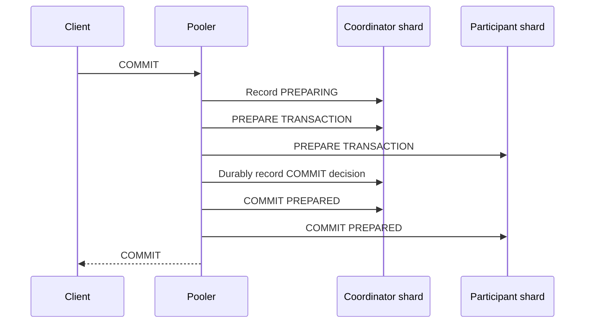

# Distributed transactions

:::info Milestone 1 design contract
This page specifies the required behavior. Distributed transaction execution and
recovery are not implemented in the foundation release; see [implementation
status](../project/status.md).
:::

When one client transaction writes to multiple shards, the Milestone 1 design
uses PostgreSQL prepared transactions. The client-facing pooler drives the
protocol, but the lowest-ID participating shard is the durable transaction
coordinator.



Before any participant prepares, the pooler durably creates one coordinator row
containing the complete, immutable participant set, state `PREPARING`, an owner
lease deadline, and a fencing generation. The lowest-ID participating shard owns
that row.

`COMMIT` and `ABORT` are single-winner decisions. A driver uses a conditional
database update equivalent to:

```sql
UPDATE distributed_transactions
SET decision = $decision
WHERE gid = $gid
  AND decision = 'PREPARING'
  AND coordinator_generation = $observed_generation
RETURNING decision;
```

The live pooler may win `COMMIT` only after every participant is durably marked
prepared. Recovery may attempt `ABORT` only after the recorded owner lease has
expired according to the coordinator database clock. If both race, one update
affects the row and the loser does not drive an outcome. Before every
`COMMIT PREPARED` or `ROLLBACK PREPARED`, every driver rereads the synchronously
replicated decision and fencing generation. Participants never infer a decision
or choose a heuristic outcome.

:::danger Isolation boundary
Distributed transactions support **`READ COMMITTED` only**. They provide an atomic final outcome and durability. They do **not** provide a global snapshot, repeatable read, serializability, external consistency, or simultaneous cross-shard visibility.
:::

During phase-two commit, a concurrent reader can temporarily observe the committed value on one shard and the old value on another. This visibility skew does not mean the final transaction outcome can partially commit; recovery continues until every participant reflects the durable decision.

## Failure behavior

- Before all participants prepare, an expired owner can atomically win `ABORT` and roll back prepared participants.
- After the durable `COMMIT` decision, recovery must commit every participant.
- A stale live pooler that loses the decision CAS stops; it cannot prepare a new participant or contradict the winner.
- If the coordinator shard is unavailable, participants remain prepared and retain locks. pgshard stops affected progress rather than guessing.
- Alerts expose old prepared transactions and recovery backlog.

## Unsupported transaction features

Before a transaction enlists a second shard, pgshard rejects behavior PostgreSQL cannot safely prepare, including temporary objects, `LISTEN`/`NOTIFY`, holdable cursors, and certain session-bound state. A transaction requesting `REPEATABLE READ` or `SERIALIZABLE` fails instead of being silently downgraded.
