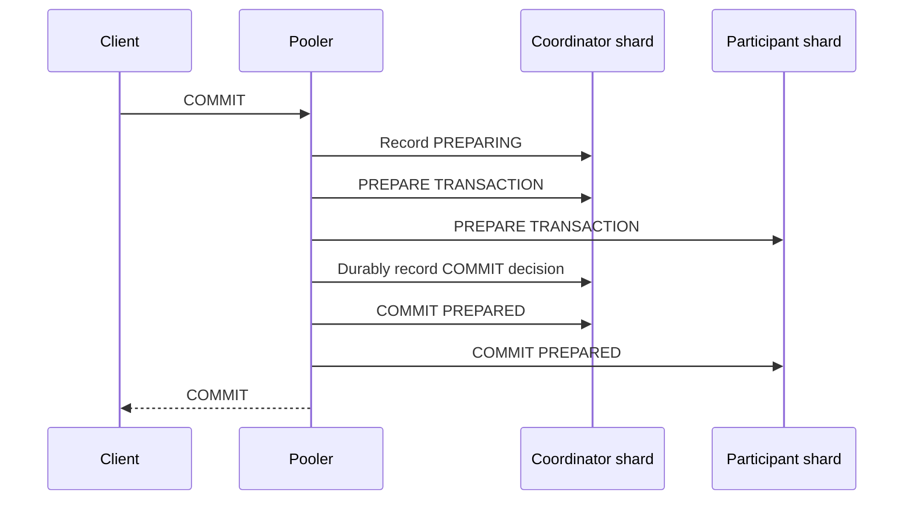

# Distributed transactions

:::info Milestone 1 design contract
This page specifies the required behavior. Distributed transaction execution and
recovery are not implemented in the foundation release; see [implementation
status](../project/status.md).
:::

When one client transaction writes to multiple shards of one logical database,
the Milestone 1 design uses PostgreSQL prepared transactions. The client-facing
pooler drives the protocol, but the lowest-ID participating physical cell is
the durable transaction coordinator. A transaction cannot enlist a shard from
another logical database, even when both databases share the same cell.



Before any participant prepares, the pooler durably creates one coordinator row
containing the complete, immutable participant set, state `PREPARING`, an owner
lease deadline, and a fencing generation. The lowest-ID participating shard owns
that row.

## Prepare-command fencing

The coordinator CAS alone is not enough: a delayed pooler command must not be
able to prepare after recovery chooses abort. Milestone 1 therefore requires a
small PostgreSQL 18 prepare-guard extension on every shard. The pooler sets the
transaction GID and coordinator generation when a transaction becomes
distributed. A `ProcessUtility` hook intercepts `PREPARE TRANSACTION`, acquires a
GID-scoped lock shared with recovery, and compares that generation with a
durable participant-local executor fence immediately before PostgreSQL prepares
the transaction. The lock is extension/session-scoped around the entire core
PostgreSQL prepare call and is released only after PostgreSQL has installed the
prepared transaction or returned failure. It is not a transaction-level
advisory lock, which a prepared transaction would retain. The generation arrives
over an authenticated internal pooler channel and cannot be set by an
application GUC or SQL statement. Poolers cannot bypass this hook or issue an
unguarded prepare.

After an owner lease expires, recovery performs this order:

1. Advance the durable executor fence for the old generation on every immutable
   participant while holding that participant's GID lock.
2. Wait for every participant to acknowledge the new fence and drain or
   terminate active old-generation backends. If any shard cannot prove the
   fence, leave the decision `PREPARING` and do not guess.
3. Attempt the coordinator `PREPARING → ABORT` CAS.
4. If abort wins, issue `ROLLBACK PREPARED` where necessary and verify every
   immutable participant has neither an active nor prepared transaction for the
   GID. If commit won, drive commit instead.

The GID lock orders a prepare hook against the local fence update. If prepare
wins, recovery observes and rolls it back after the abort decision. If fencing
wins, the delayed prepare reads a stale generation and fails. Partial fencing
can stop a live owner from completing prepare, but cannot create contradictory
decisions.

`COMMIT` and `ABORT` are single-winner decisions. A driver uses a conditional
database update equivalent to:

```sql
UPDATE distributed_transactions
SET decision = $decision
WHERE gid = $gid
  AND decision = 'PREPARING'
  AND coordinator_generation = $observed_generation
RETURNING decision;
```

The live pooler may win `COMMIT` only after every participant is durably marked
prepared. Recovery may attempt `ABORT` only after the recorded owner lease has
expired according to the coordinator database clock. If both race, one update
affects the row and the loser does not drive an outcome. Before every
`COMMIT PREPARED` or `ROLLBACK PREPARED`, every driver rereads the synchronously
replicated decision and fencing generation. Participants never infer a decision
or choose a heuristic outcome.

:::danger Isolation boundary
Distributed transactions support **`READ COMMITTED` only**. They provide an atomic final outcome and durability. They do **not** provide a global snapshot, repeatable read, serializability, external consistency, or simultaneous cross-shard visibility.
:::

During phase-two commit, a concurrent reader can temporarily observe the committed value on one shard and the old value on another. This visibility skew does not mean the final transaction outcome can partially commit; recovery continues until every participant reflects the durable decision.

## Failure behavior

- Before all participants prepare, an expired owner can atomically win `ABORT` and roll back prepared participants.
- After the durable `COMMIT` decision, recovery must commit every participant.
- A stale live pooler's guarded prepare is rejected after participant fencing;
  losing the decision CAS then stops it from contradicting the winner.
- If the coordinator shard is unavailable, participants remain prepared and retain locks. pgshard stops affected progress rather than guessing.
- Alerts expose old prepared transactions and recovery backlog.

## Unsupported transaction features

Before a transaction enlists a second shard, pgshard rejects behavior PostgreSQL cannot safely prepare, including temporary objects, `LISTEN`/`NOTIFY`, holdable cursors, and certain session-bound state. A transaction requesting `REPEATABLE READ` or `SERIALIZABLE` fails instead of being silently downgraded.
