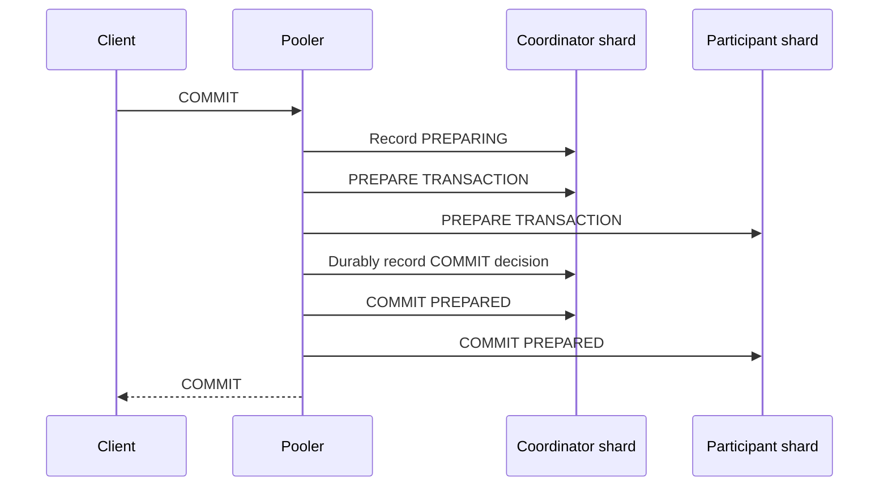

# Distributed transactions

When one client transaction writes to multiple shards, pgshard uses PostgreSQL prepared transactions. The client-facing pooler drives the protocol, but the lowest-ID participating shard is the durable transaction coordinator.

The decision is synchronously replicated before any participant receives `COMMIT PREPARED`. If the pooler fails, orchestrator recovery workers locate the decision through the transaction GID and finish it idempotently. Participants never choose a heuristic outcome.

:::danger Isolation boundary
Distributed transactions support **`READ COMMITTED` only**. They provide an atomic final outcome and durability. They do **not** provide a global snapshot, repeatable read, serializability, external consistency, or simultaneous cross-shard visibility.
:::

During phase-two commit, a concurrent reader can temporarily observe the committed value on one shard and the old value on another. This visibility skew does not mean the final transaction outcome can partially commit; recovery continues until every participant reflects the durable decision.

## Failure behavior

- Before all participants prepare, the coordinator records `ABORT` and rolls back prepared participants.
- After the durable `COMMIT` decision, recovery must commit every participant.
- If the coordinator shard is unavailable, participants remain prepared and retain locks. pgshard stops affected progress rather than guessing.
- Alerts expose old prepared transactions and recovery backlog.

## Unsupported transaction features

Before a transaction enlists a second shard, pgshard rejects behavior PostgreSQL cannot safely prepare, including temporary objects, `LISTEN`/`NOTIFY`, holdable cursors, and certain session-bound state. A transaction requesting `REPEATABLE READ` or `SERIALIZABLE` fails instead of being silently downgraded.
