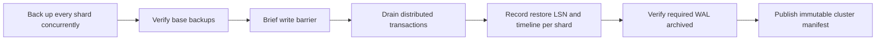

# Backup and restore

pgshard uses pgBackRest with a separate stanza and repository prefix for each shard. One physical backup per shard protects its primary and replicas because they share physical history.

The preferred source is the healthiest, most caught-up secondary. pgBackRest's standby backup still coordinates with the primary. If no safe secondary exists, pgshard falls back to the primary and records that decision in status, events, and metrics.

## Coordinated backup set

The manifest identifies the cluster, PostgreSQL major, catalog/routing epoch, source topology, every pgBackRest backup ID, restore LSN/timeline, checksums, and backup source role. A backup is usable only when all shard members, WAL, and the final manifest exist. Retention treats the complete set as one unit.

:::caution Recovery point boundary
Milestone 1 restores coordinated backup-set points. Arbitrary wall-clock cross-shard PITR is not supported because a distributed commit can straddle a timestamp.
:::

## Restore

Restore accepts an empty target only:

1. Validate the manifest, PostgreSQL 18 compatibility, backup objects, checksums, and required WAL before changing the target.
2. Restore the original source topology to the recorded per-shard positions.
3. Restore `shard-0000`, including `shardschema`, before validating the catalog.
4. Keep application Services non-serving until all shards, roles, grants, and epochs validate.
5. If the requested shard count differs, provision non-serving targets and run the normal reshard workflow.
6. Publish services only after validation succeeds.

Backups are tested against an S3-compatible MinIO deployment in KIND, including standby selection, primary fallback, interrupted uploads, missing objects, and same/different-count restore.
